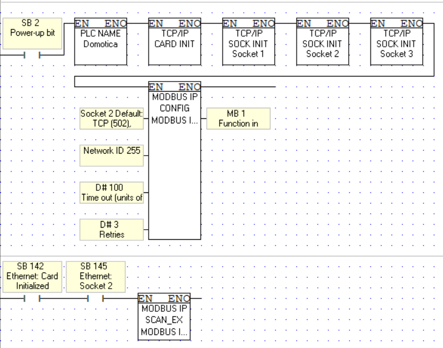

# Connecting a PLC with zigbie and external I/O's using Home assistant using Modbus TCP/IP + Modbus Serial

<!-- TABLE OF CONTENTS -->

  
Table of Contents

  <ol>
    <li>
      <a href="#about-the-project">About The Project</a>
    </li>
    <li>
      <a href="#getting-started">Getting Started</a>
      <ul>
        <li><a href="#requirements">Requirements</a></li>
        <li><a href="#products-i-used">Products I used</a></li>
      </ul>
    </li>
    <li><a href="#usage">Usage</a></li>
    <li><a href="#contributing">Contributing</a></li>
    <li><a href="#license">License</a></li>
    <li><a href="#contact">Contact</a></li>
    <li><a href="#acknowledgments">Acknowledgments</a></li>
  </ol>

***
 

## About the project:
I made this project as a school task. Ive spent time on it, but I won't get maintained, this project also is not finished yet, neither is the documentation

***

 

## Getting started:
### Requirements:
* Router
* Server/ device to run homeassistant on
* PLC, with ethernet +/ RS485 *
* External IO, with ethernet *
* raspberry pi pico *
* Zigbie gateway *
* Zigbie devices *

> *(You don't have to use all these things, since my project 
links a lot of different devices, you could just connect two with homeassistant)

 

### Products I used: 
>* [Router](https://www.tp-link.com/nl-be/home-networking/wifi-router/archer-c7/#overview)
>* [PLC: Vision 280](https://www.unitronicsplc.com/vision-series-vision280/)
>* [IO with ethernet: ADAM-5000/TCP](https://www.advantech.com/en/products/38d14508-c3eb-43f8-ab8f-a0dd5f2f7708/adam-5000-tcp/mod_7d8ea69c-0ac7-4ff6-a27e-ed2af71ed7e6)
>* [Raspberrpy pi zero2-w](https://www.raspberrypi.com/products/raspberry-pi-zero-2-w/)
>* [Zigbie gateway](https://www.lidl.be/p/nl-BE/silvercrest-gateway-smart-home/p100337892)
>* [Zigbie light](https://www.lidl.be/p/nl-BE/livarno-home-ledsfeerverlichting-smart-home/p100339626)
>* [Zigbie temperature sensor](https://nl.aliexpress.com/item/1005004989301439.html?spm=a2g0o.productlist.0.0.1d1a3b52rA5ArW&algo_pvid=98185350-5d22-47a1-9b5e-60ed13fc394d&algo_exp_id=98185350-5d22-47a1-9b5e-60ed13fc394d-30&pdp_ext_f=%7B"sku_id"%3A"12000031257188069"%7D&pdp_npi=2%40dis%21EUR%2128.52%218.56%21%21%21%21%21%40210318cb16695978022277448e6557%2112000031257188069%21sea&curPageLogUid=mpVm6jEhZCH5)
>* [Zigbie radiator valve](https://nl.aliexpress.com/item/1005004876742600.html?spm=a2g0o.productlist.0.0.1d1a3b52rA5ArW&algo_pvid=98185350-5d22-47a1-9b5e-60ed13fc394d&aem_p4p_detail=20221127171002209668958601040006196055&algo_exp_id=98185350-5d22-47a1-9b5e-60ed13fc394d-29&pdp_ext_f=%7B"sku_id"%3A"12000030857327420"%7D&pdp_npi=2%40dis%21EUR%21165.01%21123.76%21%21%21%21%21%40210318cb16695978022277448e6557%2112000030857327420%21sea&curPageLogUid=Rn7QdzVjQ0Oy&ad_pvid=20221127171002209668958601040006196055_6&ad_pvid=20221127171002209668958601040006196055_6)
>* [Server: PineA64](https://www.pine64.eu/shop/bundles.html)
>* Server: Simple desktop pc Windows

***

## Setup:

1.  Connect your router to the internet, and your server device using an ethernet cable.

2. ### Setup a server
     

    > For a <a href="#desktop">desktop server</a>, for a <a href="#pinecone">pinecone A64</a>.

    * ### Desktop:
        * > This will explain how I did it, you can use another installer, but I used a windows PC

        1. Install Home asistant using [this](https://www.home-assistant.io/installation/windows) link on your server. I used the Virtual box version.

        2. Proceed when you have gotten home assistant running

    * ### Pinecone:
        * WIP

3. ### Setup Zigbie devices
    1. Install the Tuya smart home app, and add your devices in there
    2. Follow [this](https://www.home-assistant.io/integrations/tuya/) tutorial to setup tuya with homeassistant
    3. After restarting home assistant you should be able to enable/ disable/ do other stuff with your zigbie devices.

4. ### Setup EQ3 Max!
    1. Follow [this](https://www.home-assistant.io/integrations/maxcube/) tutorial to setup the EQ3 max!

5. ### Setup a (visiologic) plc.
    First in the project settings add these settings: 
    > You can use your own IP address and a custom name

    This is the code I used to setup the PLC
    